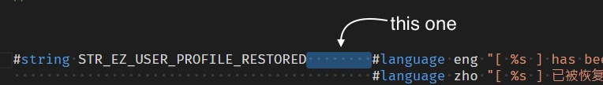

# Change Log

All notable changes to the "edk2-uni-formatter" extension will be documented in this file.

## [1.3.1]

- Remove useless class method

## [1.3.0]

- Support multiple files formatting under EXPLORER/Context.
- Support keybinding on both single file and multiple file under EXPLORER/Context.
- Support keybinding under Editor.

## [1.2.2]

- Add LFCR in "end-of-line with" option.

## [1.2.1]

- Fix some encoding type will cause formatted file garbled.

## [1.2.0]

- Add end-of-line with:[CR, CRLF, LF] configuration
- Fix if file first line only contain spaces will cause formatted file garbled.
- Fix if language define's name matches identifier value will cause formatted value being cut.
- Change max space's configuration name(the configuration added on 1.1.0)

## [1.1.2]

- Use yarn instead
- Code clean up

## [1.1.1]

- Add icon

## [1.1.0]

- Add feature for user can define spaces between Token and LanguageCode.
  

## [1.0.5]

- Add the usage under EXPLORER on README.

## [1.0.4]

- Now the extension supports on EXPLORER.

## [1.0.3]

- Add CR at the end of string.

## [1.0.2]

- Change Display name.

## [1.0.1]

- Fix identifier name missing when use tab(s) and/or multiple spaces behind #string.

## [1.0.0]

- Now support all kinds of encoding.

## [0.0.2]

- change detect encoding module from "encoding-japanese" to "chardet".
