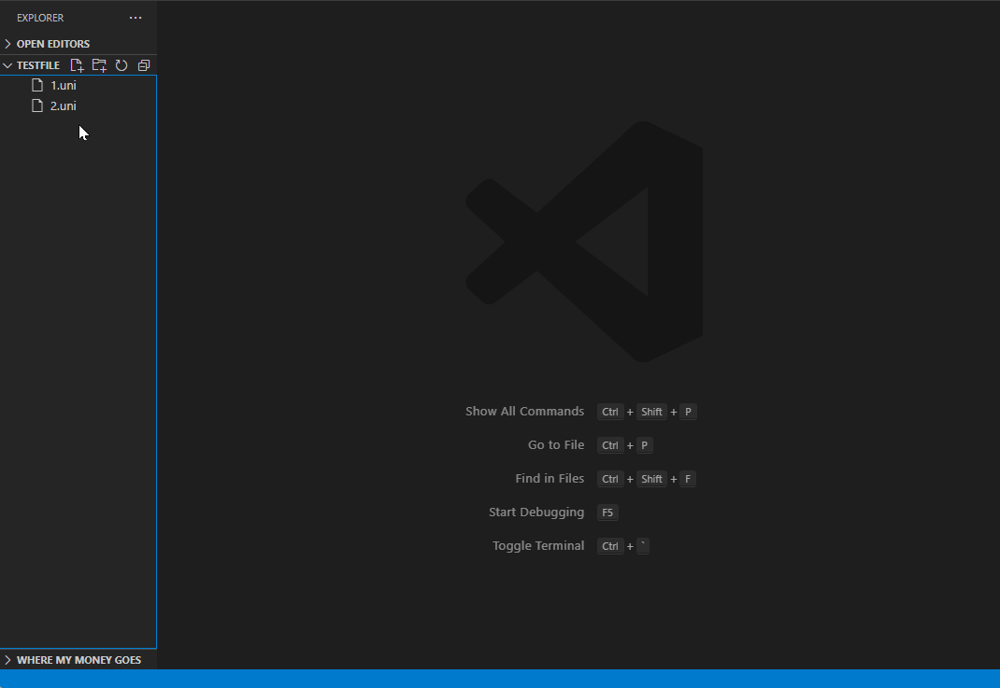

# edk2-uni-formatter

The Microsoft VSCode extension formats EDK2 unicode files(_.uni_).

## Installation

Via Visual Studio Marketplace [edk2-uni-formatter](https://marketplace.visualstudio.com/items?itemName=pinshengjuan.edk2-uni-formatter)

## Under editor text focus

- Under _.uni_ file, right click and select "Formate Document".
  

## Under EXPLORER

- Right click and select "Formate Document"(support both single file and multiple files).
  
  

## Keybinding

- editor text focus.
  
- EXPLORER (single file).
  
- EXPLORER (multiple files).
  

### Configuration

1. The configuration "End Of Line With":
   The escape code that adds at the end of each line.
2. The configuration "Space Between Token and LanguageCode":
   The extension will first make an alignment base on the longest name of Token, then this configuration is used to add space(s) behind, the number of space(s) is/are user's define.

### Unsupported encoding: UTF-16 BE
